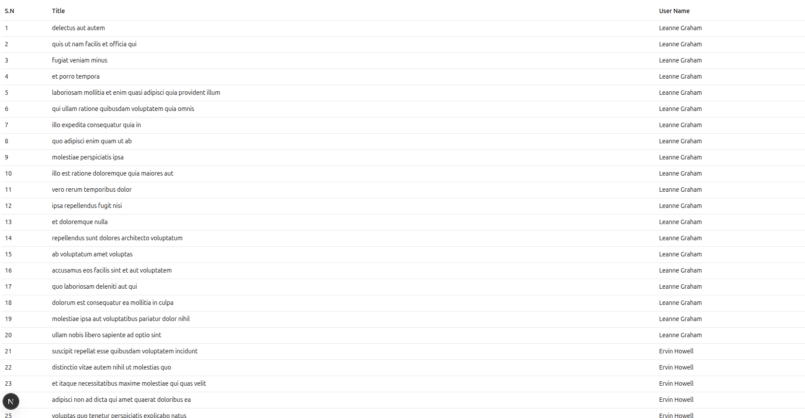

# GraphQL + REST API Demo Project

This project demonstrates how to use **GraphQL** alongside a traditional **REST API** (the JSONPlaceholder Todos API) to fetch and work with data efficiently.

---

## What is GraphQL?

[GraphQL](https://graphql.org) is a **query language for your API** and a runtime for executing those queries with your existing data.

Unlike fixed REST endpoints that return entire objects, GraphQL lets clients request **exactly the fields they need** and nothing more.

---

## Why Use GraphQL?

GraphQL solves common API problems such as:

- **Over-fetching data**  
  Only request the fields you need, reducing unnecessary data transfer.

- **Under-fetching data**  
  Fetch related data for multiple objects in a single query instead of multiple REST calls.

- **Evolving APIs without breaking clients**  
  Add new fields and capabilities without affecting existing queries.

- **Better developer experience**  
  Tools like GraphiQL provide interactive querying and API exploration.

---

## Environment Variables

### Server-side

Create a `.env` file in your server root:

```
PORT=8000
API=https://jsonplaceholder.typicode.com
```

### Client-side (Next.js)

Create a `.env` file in your Next.js project:

```
NEXT_PUBLIC_BACKEND_URI=http://localhost:8000/graphql
```

---

## Example GraphQL Query

Fetch a user by ID with only specific fields:

```graphql
{
  getUserById(id: "1") {
    id
    name
    email
  }
}
```

Or fetch todos along with the user's name:

```graphql
{
  getTodos {
    id
    title
    completed
    user {
      id
      name
    }
  }
}
```

---

## Getting Started

1. Clone the repository:

   ```bash
   git clone <repository-url>
   cd <project-directory>
   ```

2. Install dependencies:

   ```bash
   npm install
   ```

3. Create `.env` files as shown above.

4. Start the server:

   ```bash
   npm run dev
   ```

5. Open your client app (e.g. Next.js) and query the GraphQL endpoint at:

   ```
   http://localhost:8000/graphql
   ```

---


## Expected Output

The Next.js frontend will display a table with todos data including:

- **S.N** (Serial Number)
- **Title** (Todo title from the API)  
- **User Name** (Associated user name)



*Screenshot showing the todos table with data fetched via GraphQL*

---
## Learn More

- [GraphQL Official Documentation](https://graphql.org/learn/)
- [Apollo GraphQL - main](https://www.apollographql.com/)
- [Apollo GraphQL - Server ](https://www.apollographql.com/docs/apollo-server)
- [Apollo GraphQL - Client(react)](https://www.apollographql.com/docs/react)
- [JSONPlaceholder REST API](https://jsonplaceholder.typicode.com/)